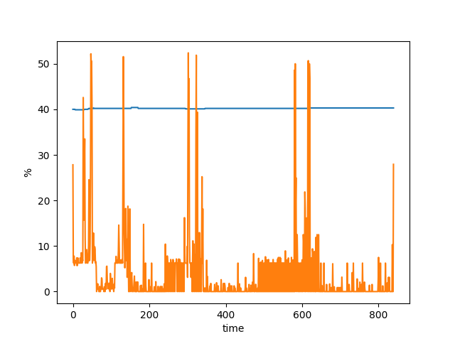

## Install Python Dependencies

`pip install psutil matplotlib`


## Create Profile Decorator

```python
import time
import psutil
import _thread
import matplotlib.pyplot as plt


STATS = {
    "cpu": [],
    "mem": []
}


def get_cpu_mem_info():
    while True:
        memoryUse = psutil.virtual_memory().percent
        cpu_avg_load = sum(psutil.cpu_percent(percpu=True)) / psutil.cpu_count()
        STATS["cpu"].append(cpu_per)
        STATS["mem"].append(memoryUse)
        print(memoryUse,  cpu_avg_load)
        time.sleep(0.2)

def plot_stats():
    fig, ax = plt.subplots(1, 1)
    x_array = [index for index, a in enumerate(STATS["mem"])]
    ax.plot(x_array, STATS["mem"])
    ax.plot(x_array, STATS["cpu"])
    ax.set_xlabel('time')
    ax.set_ylabel('%')
    fig.savefig('stats.png', dpi=fig.dpi)


def profile(func):
    def wrapper(*args, **kwargs):

        # get_cpu_mem_info() will keep running until func finished
        _thread.start_new_thread(get_cpu_mem_info, ())

        result = func(*args, **kwargs)

        # save plot  
        plot_stats()
        return result
    return wrapper
```

## Sample Plot


